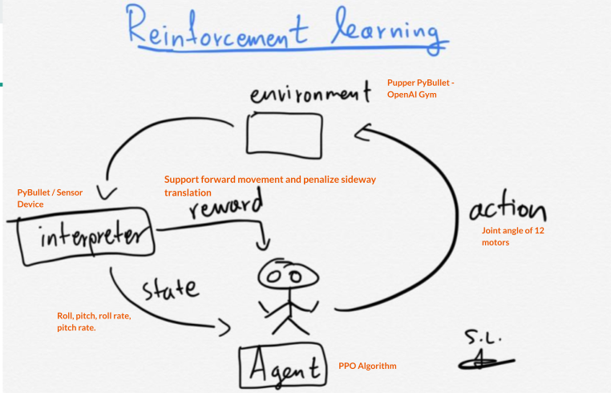
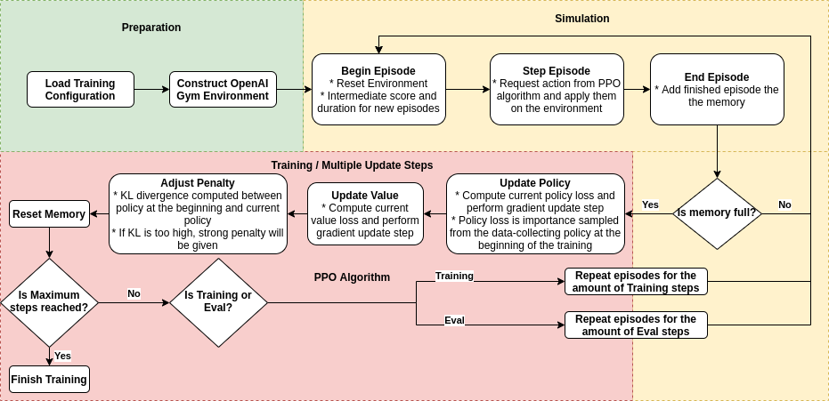
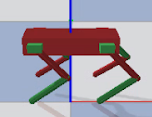
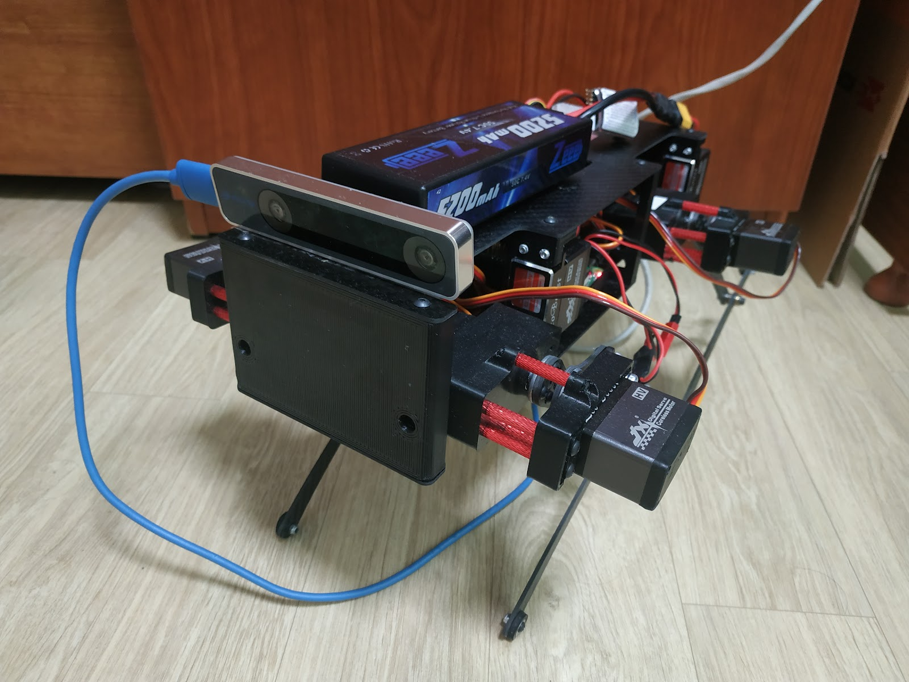
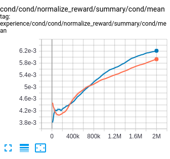
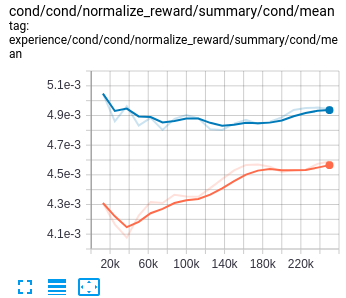
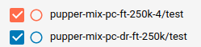

# PupperAI 

## Overview

This repository use robot model based on Stanford Pupper quadruped.

Robot goal is to walk as far as it can on given time.

## Key Features :
- Deep Reinforcement Learning (DRL) with PPO agent.
- Transfer learning.
- Domain Randomization.

## How it works 

## PyBullet Model

## Real Robot

## Evaluation
### Training Performance

### Testing Performance

Deploy
